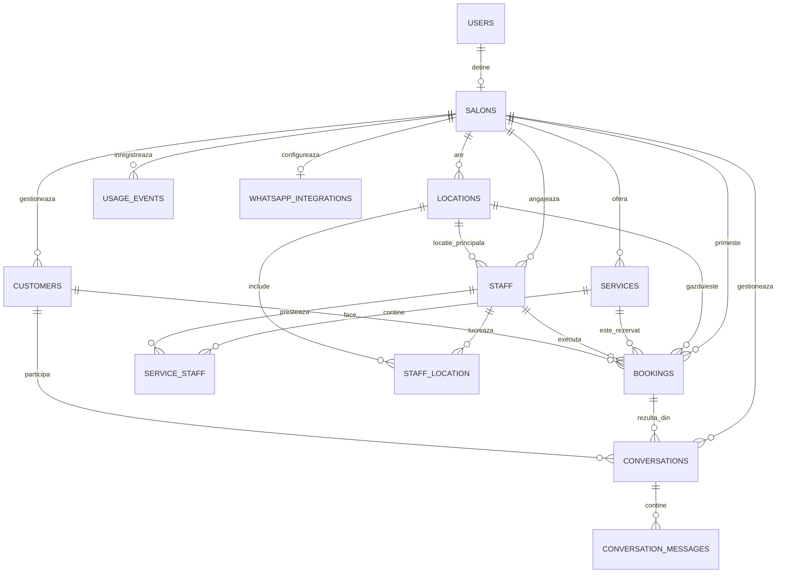

# Schema bazei de date

Documentul descrie schema curentă a bazei de date YouGo, construită din migrațiile Laravel și relațiile Eloquent. Baza de date configurată pentru dezvoltare este MySQL.

## Vedere de ansamblu

`salons` este entitatea centrală și reprezintă contul unui business, chiar dacă numele tabelului provine din domeniul inițial al aplicației. Majoritatea datelor funcționale sunt izolate prin `salon_id`.

## Convenții

- Cheile primare sunt `id` de tip `BIGINT UNSIGNED`, exceptând tabelele tehnice care folosesc chei string.
- Tabelele de domeniu au `created_at` și `updated_at`.
- Câmpurile marcate `nullable` sunt opționale.
- `cascadeOnDelete` șterge automat înregistrările dependente.
- `nullOnDelete` păstrează înregistrarea dependentă, dar setează cheia externă la `NULL`.
- Câmpurile JSON sunt convertite în array-uri de modelele Eloquent.

## Tabele de domeniu

### `users`

Conturile utilizatorilor care dețin business-uri.

| Coloană | Tip / reguli | Rol |
|---|---|---|
| `id` | PK | Identificator utilizator |
| `name` | string | Nume afișat |
| `email` | string, unic | Adresă folosită la autentificare |
| `email_verified_at` | timestamp, nullable | Data verificării adresei |
| `password` | string | Hash-ul parolei |
| `is_platform_admin` | boolean, implicit `false` | Marcaj administrativ păstrat pe utilizator |
| `remember_token` | string, nullable | Token Laravel pentru sesiuni persistente |
| `created_at`, `updated_at` | timestamp | Audit temporal |

Relație: un utilizator poate avea un singur `salon`.

### `platform_admins`

Conturi administrative separate de utilizatorii business-urilor.

| Coloană | Tip / reguli | Rol |
|---|---|---|
| `id` | PK | Identificator administrator |
| `name` | string, implicit `Platform Admin` | Nume afișat |
| `username` | string, unic | Identificator de autentificare |
| `password` | string | Hash-ul parolei |
| `remember_token` | string, nullable | Token pentru sesiuni persistente |
| `created_at`, `updated_at` | timestamp | Audit temporal |

### `salons`

Tabelul principal al aplicației. O înregistrare reprezintă un business și conține configurarea comercială, localizarea, widgetul, abonamentul și comportamentul asistentului AI.

| Grup | Coloane |
|---|---|
| Identitate | `id`, `user_id` FK, `name`, `logo_path` nullable |
| Abonament | `plan` implicit `free`, `plan_started_at`, `trial_ends_at`, `stripe_customer_id`, `stripe_subscription_id`, `stripe_price_id`, `subscription_status`, `subscription_current_period_end` |
| Profil business | `industry`, `mode` implicit `appointment`, `business_type`, `website`, `business_phone` |
| Localizare | `country`, `timezone` implicit `Europe/London`, `currency`, `phone_prefix`, `display_language` implicit `ro`, `date_format` implicit `DD/MM/YYYY` |
| Onboarding | `onboarding_completed`, `onboarding_skipped`, `onboarding_completed_at`, `onboarding_skipped_at` |
| Notificări | `notification_email`, `email_notifications`, `missed_call_alerts`, `booking_confirmations`, `booking_status_email_notifications` |
| Widget | `widget_key` unic, `widget_enabled`, `widget_allowed_domains` JSON, `widget_primary_color`, `widget_cta_text` max. 80, `widget_position` |
| Catalog legacy | `service_categories` JSON, `service_staff` JSON |
| Personalitate AI | `ai_assistant_name` implicit `Bella`, `ai_tone`, `ai_response_style`, `ai_language_mode`, `ai_greeting_message` |
| Context AI | `ai_custom_instructions`, `ai_business_summary`, `ai_about_business`, `ai_policies`, `ai_faq`, `ai_recommendations`, `ai_avoid` |
| Clasificare AI | `ai_industry_categories` JSON, `ai_main_focus`, `ai_custom_context` JSON |
| Reguli AI | `ai_booking_enabled`, `ai_collect_phone`, `ai_handoff_message`, `ai_unknown_answer_policy` |
| Audit | `created_at`, `updated_at` |

Constrângeri și observații:

- `user_id -> users.id`, cu ștergere în cascadă.
- `widget_key` este cheia publică unică folosită pentru încărcarea widgetului.
- `stripe_customer_id` și `stripe_subscription_id` sunt indexate.
- Valorile uzuale pentru `mode` sunt `appointment`, `reservation` și `lead`.
- `service_categories` și `service_staff` sunt structuri istorice; relațiile normalizate pentru personal sunt în `staff`, `service_staff` și `staff_location`.

### `locations`

Locațiile fizice ale unui business.

| Coloană | Tip / reguli | Rol |
|---|---|---|
| `id` | PK | Identificator locație |
| `salon_id` | FK | Business-ul proprietar |
| `name`, `address` | string | Identitate și adresă |
| `email`, `phone` | string, nullable | Date de contact |
| `hours` | JSON, nullable | Programul locației |
| `max_concurrent_bookings` | unsigned integer, nullable | Capacitate simultană; `NULL` înseamnă fără limită specifică |
| `created_at`, `updated_at` | timestamp | Audit temporal |

`salon_id` se șterge în cascadă. O locație poate fi locația principală a mai multor membri ai personalului și poate fi asociată suplimentar prin `staff_location`.

### `services`

Catalogul de servicii oferite de business.

| Coloană | Tip / reguli | Rol |
|---|---|---|
| `id` | PK | Identificator serviciu |
| `salon_id` | FK | Business-ul proprietar |
| `name` | string | Denumire |
| `type` | string, nullable | Categorie sau tip |
| `staff` | JSON, nullable | Listă legacy de personal |
| `price` | string | Preț păstrat ca text |
| `currency` | string(10), nullable | Moneda proprie; `NULL` permite moștenirea monedei business-ului |
| `duration` | unsigned integer, implicit `30` | Durata în minute |
| `max_concurrent_bookings` | unsigned integer, nullable | Capacitatea simultană |
| `notes` | text, nullable | Detalii interne sau context |
| `location_ids` | JSON, nullable | Lista locațiilor în care este disponibil |
| `created_at`, `updated_at` | timestamp | Audit temporal |

`salon_id` se șterge în cascadă. Personalul normalizat este asociat many-to-many prin `service_staff`.

### `staff`

Membrii personalului unui business.

| Coloană | Tip / reguli | Rol |
|---|---|---|
| `id` | PK | Identificator membru |
| `salon_id` | FK | Business-ul proprietar |
| `location_id` | FK, nullable | Locația principală |
| `name` | string | Nume |
| `role`, `email`, `phone` | string, nullable | Date profesionale și de contact |
| `active` | boolean, implicit `true` | Disponibilitate în sistem |
| `working_hours` | JSON, nullable | Program individual |
| `created_at`, `updated_at` | timestamp | Audit temporal |

`salon_id` se șterge în cascadă. Dacă locația principală este ștearsă, `location_id` devine `NULL`.

### `service_staff`

Tabel pivot între servicii și personal.

| Coloană | Tip / reguli |
|---|---|
| `id` | PK |
| `service_id` | FK către `services`, cascade delete |
| `staff_id` | FK către `staff`, cascade delete |
| `created_at`, `updated_at` | timestamp |

Perechea (`service_id`, `staff_id`) este unică.

### `staff_location`

Tabel pivot pentru locațiile suplimentare în care lucrează personalul.

| Coloană | Tip / reguli |
|---|---|
| `id` | PK |
| `staff_id` | FK către `staff`, cascade delete |
| `location_id` | FK către `locations`, cascade delete |
| `created_at`, `updated_at` | timestamp |

Perechea (`staff_id`, `location_id`) este unică.

### `customers`

Registrul de clienți, izolat per business.

| Coloană | Tip / reguli | Rol |
|---|---|---|
| `id` | PK | Identificator client |
| `salon_id` | FK | Business-ul proprietar |
| `name`, `phone`, `email` | string, nullable | Datele originale |
| `phone_normalized`, `email_normalized` | string, nullable | Valori folosite la deduplicare |
| `first_seen_at`, `last_seen_at` | timestamp, nullable | Prima și ultima interacțiune |
| `notes` | text, nullable | Observații |
| `metadata` | JSON, nullable | Date extensibile |
| `created_at`, `updated_at` | timestamp | Audit temporal |

Constrângeri:

- `salon_id` se șterge în cascadă.
- (`salon_id`, `phone_normalized`) este unic.
- (`salon_id`, `email_normalized`) este unic.
- (`salon_id`, `last_seen_at`) este indexat pentru listări recente.

### `bookings`

Rezervările sau programările clienților.

| Coloană | Tip / reguli | Rol |
|---|---|---|
| `id` | PK | Identificator rezervare |
| `salon_id` | FK | Business-ul proprietar |
| `customer_id` | FK, nullable | Client normalizat |
| `location_id` | FK, nullable | Locația rezervării |
| `service_id` | FK, nullable | Serviciul rezervat |
| `staff_id` | FK, nullable | Membrul de personal asignat |
| `client_name` | string | Numele capturat la rezervare |
| `client_phone` | string, nullable | Telefonul capturat |
| `staff` | JSON, nullable | Snapshot sau structură legacy de personal |
| `date` | date | Data rezervării |
| `time` | string(5) | Ora în format `HH:MM` |
| `status` | string, implicit `pending` | `pending`, `confirmed`, `cancelled` sau `completed` |
| `source` | string, nullable | Canalul care a creat rezervarea |
| `notification_sent_at` | timestamp, nullable | Momentul trimiterii notificării |
| `created_at`, `updated_at` | timestamp | Audit temporal |

`salon_id` se șterge în cascadă. Pentru `customer_id`, `location_id`, `service_id` și `staff_id`, ștergerea entității referite setează cheia la `NULL`, păstrând istoricul rezervării.

### `conversations`

Conversațiile purtate prin widget, WhatsApp sau alte canale.

| Coloană | Tip / reguli | Rol |
|---|---|---|
| `id` | PK | Identificator conversație |
| `salon_id` | FK | Business-ul proprietar |
| `booking_id` | FK, nullable | Rezervarea asociată |
| `customer_id` | FK, nullable | Clientul asociat |
| `visitor_number` | unsigned integer, nullable | Număr local al vizitatorului |
| `channel` | string, implicit `chat` | Canalul conversației |
| `provider` | string, nullable | Furnizor extern, de exemplu Twilio |
| `external_contact_id`, `external_sender` | string, nullable | Identificatori din sistemul extern |
| `contact_name`, `contact_phone`, `contact_email` | string, nullable | Date de contact capturate |
| `status` | string, implicit `open` | Starea conversației |
| `intent` | string, implicit `inquiry` | Intenția clasificată |
| `duration_seconds` | unsigned integer, nullable | Durata interacțiunii |
| `summary` | text, nullable | Rezumatul conversației |
| `metadata` | JSON, nullable | Date specifice canalului |
| `last_message_at` | timestamp, nullable | Ultima activitate |
| `created_at`, `updated_at` | timestamp | Audit temporal |

`salon_id` se șterge în cascadă, iar `booking_id` și `customer_id` folosesc `SET NULL`. Există indexuri pe (`salon_id`, `channel`, `external_contact_id`) și (`salon_id`, `customer_id`).

### `conversation_messages`

Mesajele individuale dintr-o conversație.

| Coloană | Tip / reguli | Rol |
|---|---|---|
| `id` | PK | Identificator mesaj |
| `conversation_id` | FK | Conversația părinte |
| `role` | string | Rol logic, de exemplu user sau assistant |
| `direction` | string, nullable | Sensul mesajului: inbound sau outbound |
| `provider` | string, nullable | Furnizorul extern |
| `provider_message_id` | string, nullable, unic | ID extern folosit pentru idempotentă |
| `content` | long text | Conținutul mesajului |
| `metadata` | JSON, nullable | Stare de livrare și alte date externe |
| `created_at`, `updated_at` | timestamp | Audit temporal |

Mesajele sunt șterse în cascadă odată cu conversația.

### `whatsapp_integrations`

Configurarea integrării WhatsApp a unui business.

| Coloană | Tip / reguli | Rol |
|---|---|---|
| `id` | PK | Identificator integrare |
| `salon_id` | FK, unic | Relație one-to-one cu business-ul |
| `provider` | string, implicit `twilio` | Furnizorul integrării |
| `requested_number` | string, nullable | Numărul solicitat |
| `twilio_sender` | string, nullable, unic | Expeditorul tehnic Twilio |
| `display_number` | string, nullable | Numărul afișat |
| `status` | string, implicit `not_connected` | Starea integrării |
| `ai_enabled` | boolean, implicit `false` | Activează răspunsurile AI |
| `last_verified_at`, `activated_at`, `requested_at` | timestamp, nullable | Momente din ciclul de configurare |
| `metadata` | JSON, nullable | Configurare extensibilă |
| `created_at`, `updated_at` | timestamp | Audit temporal |

`salon_id` se șterge în cascadă. Perechea (`provider`, `status`) este indexată.

### `usage_events`

Evenimente contorizabile folosite pentru limite de plan și raportare.

| Coloană | Tip / reguli | Rol |
|---|---|---|
| `id` | PK | Identificator eveniment |
| `salon_id` | FK | Business-ul proprietar |
| `event_type` | string | Tipul consumului |
| `source` | string, nullable | Sursa evenimentului |
| `quantity` | unsigned integer, implicit `1` | Cantitatea consumată |
| `metadata` | JSON, nullable | Context suplimentar |
| `occurred_at` | timestamp | Momentul producerii |
| `created_at`, `updated_at` | timestamp | Audit temporal |

Indexul (`salon_id`, `event_type`, `occurred_at`) optimizează calcularea consumului într-un interval.

## Tabele tehnice Laravel

| Tabel | Scop |
|---|---|
| `password_reset_tokens` | Tokenuri temporare pentru resetarea parolei |
| `sessions` | Sesiuni web; `user_id` este indexat, dar nu are constrângere FK |
| `cache` | Cache persistent key-value |
| `cache_locks` | Lock-uri pentru operații concurente |
| `jobs` | Joburi în coada Laravel |
| `job_batches` | Grupuri de joburi |
| `failed_jobs` | Joburi eșuate și excepțiile lor |
| `migrations` | Evidența migrațiilor executate |

## Reguli de integritate importante

1. Datele funcționale trebuie filtrate întotdeauna după `salon_id`; acesta este mecanismul principal de separare între business-uri.
2. Relațiile many-to-many valide sunt păstrate în tabelele pivot, nu în câmpurile JSON legacy.
3. Ștergerea unui business elimină în cascadă locațiile, serviciile, personalul, clienții, rezervările, conversațiile, evenimentele de consum și integrarea WhatsApp.
4. Istoricul rezervărilor și conversațiilor este protejat prin `SET NULL` când se șterge o entitate opțională asociată.
5. Prețul este stocat ca string, nu ca tip decimal; calculele monetare trebuie să normalizeze explicit valoarea și moneda.
6. `bookings.time` este un string `HH:MM`, iar fusul orar este definit la nivelul business-ului în `salons.timezone`.

## Surse de adevăr

- Structura fizică: `database/migrations/`
- Relațiile și cast-urile aplicației: `app/Models/`
- Configurarea conexiunii: `.env` și `config/database.php`

Documentul reflectă migrațiile existente la 6 iunie 2026.
